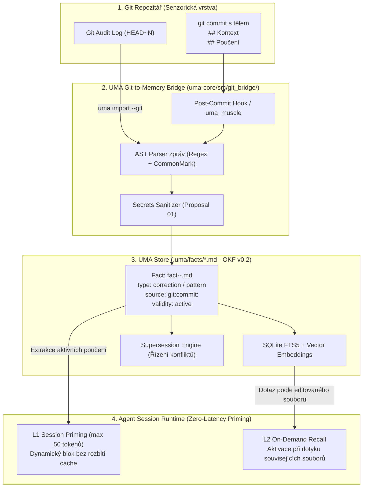
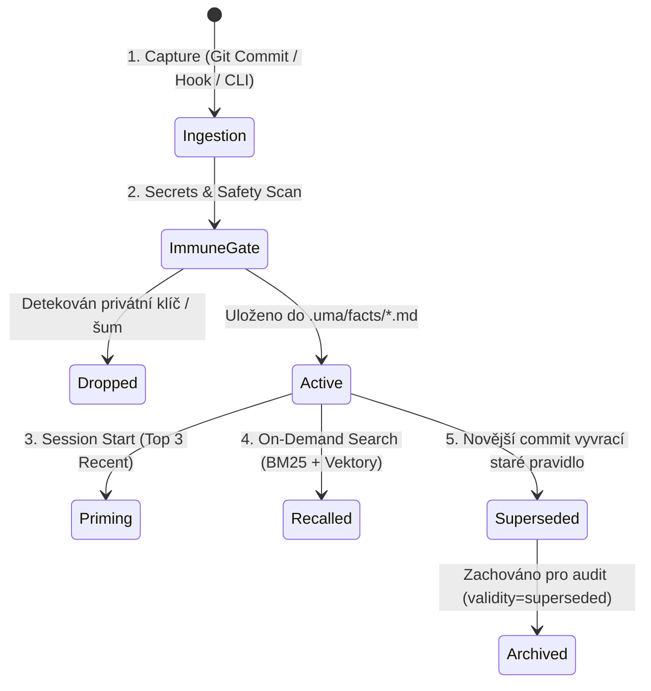

# Proposal 06: Git-to-Memory Bridge a životní cyklus paměťových Markdown souborů (Episodic Git Distillation, Semantic OKF v0.2 Crystallization & Session Priming)

**Status:** Draft / Architectural Proposal  
**Cílová vrstva:** `uma-core/src/git_bridge/`, `uma-cli/src/slices/import/`, `uma-cli/src/slices/prime/`, `.uma/facts/*.md`, `uma-pi-extension/`  
**Vazby na předchozí návrhy:**  
- **Využívá Svalovou paměť z [Proposal 05](file:///D:/01_programovani/ai-memory/docs/proposals/05-procedural-muscle-memory-and-cognitive-priming.md):** Automatizuje vícekrokové rutiny commitování (`uma_muscle("atomic_commit")`) a rychlého ověření bez plýtvání System 2 tokeny.  
- **Spolupracuje se Stínovým pracovníkem z [Proposal 02](file:///D:/01_programovani/ai-memory/docs/proposals/02-shadow-brain-zero-latency-distillation.md):** Asynchronně vytěžuje sekce `## Kontext` a `## Poučení` na pozadí během práce agenta.  
- **Podléhá Kognitivní imunitě z [Proposal 01](file:///D:/01_programovani/ai-memory/docs/proposals/01-cognitive-immune-interceptor.md):** Striktní kontrola tajemství (žádné tokeny, `.env` hodnoty ani credentials nesmí projít do paměťového Markdownu).  
- **Moduluje Synaptické váhy z [Proposal 03](file:///D:/01_programovani/ai-memory/docs/proposals/03-synaptic-plasticity-executable-contracts.md):** Fakta vzniklá z chybových commitů (`🐛 fix`) získávají vyšší počáteční váhu a odolnost vůči rozpadu.  
- **Integruje Vnitřní sněm z [Proposal 04](file:///D:/01_programovani/ai-memory/docs/proposals/04-internal-council-and-prudence.md):** Poučení z commitů tvoří základ pro varování *Ďáblova advokáta* (Pain Score kalkulace).  
**Datum:** 2026-10-08  

---

## 1. Motivace a kontext stávajícího vývojářského workflow

V repozitáři [`claudes/docs/`](file:///D:/01_programovani/claudes/docs/) existuje již dnes propracovaný a přísně strukturovaný systém instrukcí pro agenty:
- [`claudes/docs/git-workflow.md`](file:///D:/01_programovani/claudes/docs/git-workflow.md): Definuje závazná pravidla práce s gitem, zejména:
  - **Pravidlo 0:** `Start session → git log -3 --pretty=format:"%h %s%n%b" → stručně shrň uživateli, co se dělalo.`
  - **Pravidlo 1–3:** Atomické commity po každé logické změně, snapshoty před rizikem, 1 commit = 1 změna.
  - **Pravidlo 4:** Striktní zákaz ukládání tajemství (vše v `.env`).
  - **Struktura commitu s povinným tělem:**
    ```text
    <emoji> <type>: <subject max 72 znaků>

    ## Kontext
    <proč se to dělalo / co bylo špatně>

    ## Poučení
    <co si zapamatovat, anti-patterny, tipy>
    ```
- [`claudes/CLAUDE.md`](file:///D:/01_programovani/claudes/CLAUDE.md): Stanovuje principy chování (česky, stručně, nejistota $\rightarrow$ STOP, jednoduchost nade vše, nejmenší diff).
- [`claudes/docs/architektura.md`](file:///D:/01_programovani/claudes/docs/architektura.md): Vertical Slices Architecture (VSA), Deep Modules, soubory max ~300 řádků, izolace sliců.
- [`claudes/docs/konvence.md`](file:///D:/01_programovani/claudes/docs/konvence.md): Intention-revealing naming, Guard clauses, typová bezpečnost, komentovat jen „proč“.
- [`claudes/docs/testovani.md`](file:///D:/01_programovani/claudes/docs/testovani.md): Konvence `should_<výsledek>_when_<podmínka>`, kolokace testů u slicu.
- [`claudes/docs/workflow.md`](file:///D:/01_programovani/claudes/docs/workflow.md): Schvalování plánů předem, specializované skilly (`code-review`, `simplify`, `verify`, `security-review`).

### Problém stávajícího stavu: „Epizodická slepota po 3 commitech“
Dosavadní praxe spoléhá na to, že agent při startu zavolá `git log -3`. Toto řešení má tři fatální slabiny:
1. **Ztráta paměti po 3 commitech:** Pokud proběhne zásadní oprava s kritickým poučením (*„Pozor: SQLite v CLI slice nesmí otevírat DB přímo bez WAL módu, jinak nastane deadlock“*) a následně vývojář udělá 3 drobné úpravy (např. *„docs: překlep v README“*, *„deps: bump syn“*, *„fmt: cargo clippy“*), toto poučení **z horizontu agenta navždy zmizí**.
2. **Destrukce Prompt Cache (KV Cache Invalidation):** Pokud by byl výstup `git log -3` vkládán přímo do systémového promptu, dynamická změna textu s každým commitem zneplatní prefixovou cache modelu (Claude 3.7 / GPT-4o / Gemini 2.5). Uživatel přichází o 90 % cenového zvýhodnění a čeká zbytečně na Time-To-First-Token.
3. **Plýtvání tokeny a nesoustředěnost:** Agent dostává surový text se seznamem souborů, hashi a autory. Často navíc zapomene příkaz při startu zavolat, pokud ho uživatel okamžitě úkoluje konkrétním bugem.

Tento proposal definuje **Git-to-Memory Bridge**, který propojuje existující gitové workflow přímo s architekturou UMA a jejími paměťovými Markdown soubory (standard OKF v0.2).

---

## 2. Architektura: Git jako událostní senzor, UMA jako sémantický ledger



---

## 3. Formát a transformace: Z Git Commit Body do OKF v0.2 Markdownu

### 3.1 Vstupní formát commitu (dle `claudes/docs/git-workflow.md`)
Příklad reálného commitu v projektu:
```text
🐛 fix(search): vyřešení deadlocku v SQLite při souběžném čtení a zápisu

## Kontext
Při souběžném volání Store::search_all a Store::write docházelo k chybě
'database is locked', protože SQLite připojení nebylo inicializováno v WAL módu.

## Poučení
1. Vždy nastavit PRAGMA journal_mode = WAL a busy_timeout = 5000ms v Store::new().
2. Nikdy neotvírat rusqlite Connection přímo uvnitř CLI sliců; veškerý přístup
   musí jít výhradně přes jádro uma-core.
```

### 3.2 Deterministická extrakční pravidla (Rust AST Transformer)
Žádné drahé ani nespolehlivé LLM volání. Jádro UMA (`uma-core/src/git_bridge/parser.rs`) provede deterministický rozpad:

1. **Určení typu faktu (`FactType`):**
   - Prefix `🐛 fix` $\rightarrow$ `FactType::Correction` (chyba, kterou nesmíme opakovat).
   - Prefix `✨ feat` nebo `♻️ refactor` $\rightarrow$ `FactType::Pattern` nebo `FactType::Decision`.
   - Prefixy bez těla (`🔖 snapshot`, `📝 docs`, `🔧 config`, `📦 deps`, `🔥 remove`) $\rightarrow$ vynechávají se z paměti, neobsahují kognitivní pravidla.
2. **Generování metadat (YAML Frontmatter):**
   - `id`: `fact-<timestamp>-<short_sha>` (např. `fact-20261008-8f4c21a`).
   - `title`: Subject commitu očištěný o konvenční prefix.
   - `type`: Odvozený z typu commitu.
   - `scope`: `Scope::Project` (nebo `Scope::Global`, pokud obsahuje tag `#global`).
   - `source`: `git:commit:<full_sha>`.
   - `tags`: Automaticky extrahovány z:
     - Scope commitu v závorce (`search` $\rightarrow$ `search`).
     - Modifikovaných cest z `git diff-tree` (např. `uma-core/src/store/search.rs` $\rightarrow$ `store`, `sqlite`).
3. **Generování těla (Markdown OKF v0.2):**
   - Sekce `## Kontext` se namapuje do odstavce **Context**.
   - Sekce `## Poučení` se namapuje do odstavců **Rule** a **Consequences**.

### 3.3 Výsledný trvalý soubor `.uma/facts/fact-20261008-8f4c21a.md`
```markdown
---
id: fact-20261008-8f4c21a
title: "Vyřešení deadlocku v SQLite při souběžném čtení a zápisu"
type: correction
scope: project
validity: active
source: "git:commit:8f4c21a92e105b"
tags:
  - search
  - sqlite
  - concurrency
  - uma-core
created_at: 2026-10-08T22:15:00Z
synaptic_weight: 0.95
pain_score_threshold: 80
---

## Context
Commit 8f4c21a: Při souběžném volání `Store::search_all` a `Store::write`
docházelo k chybě `database is locked`, protože SQLite připojení nebylo
inicializováno v WAL módu.

## Rule
1. Vždy nastavit `PRAGMA journal_mode = WAL` a `busy_timeout = 5000ms` v `Store::new()`.
2. Nikdy neotvírat `rusqlite::Connection` přímo uvnitř CLI sliců; veškerý přístup
   musí jít výhradně přes jádro `uma-core`.

## Consequences
Zabraňuje pádu CLI a deadlocku při souběžném dotazování agentem během zápisu.
Porušení tohoto pravidla aktivuje imunitní interceptor s vysokým Pain Score.
```

---

## 4. Životní cyklus paměťových Markdown souborů (The 5-Stage Lifecycle)

Práce s paměťovými Markdown soubory v UMA není jednosměrný zápis; prochází přesně definovanými fázemi životního cyklu:



### Fáze 1: Ingesce (Capture)
Může probíhat třemi cestami:
1. **Svalová rutina po dokončení práce (`uma_muscle("atomic_commit")`):**
   Agent dokončí změnu, spustí testy a vytvoří atomický commit s tělem `## Kontext` a `## Poučení`. UMA vestavěný hook okamžitě převezme tělo commitu a zapíše nový `.md` fakt do `.uma/facts/`.
2. **Nativní Git Post-Commit Hook (`.git/hooks/post-commit`):**
   Pro případy, kdy commit vytváří člověk nebo standardní git nástroj bez přímého volání UMA:
   ```bash
   #!/bin/sh
   uma import --last-commit --quiet
   ```
3. **Zpětná těžba historie (`uma import --git [N]`):**
   Při nasazení UMA do existujícího projektu se projde posledních $N$ commitů (např. 50). Všechny commity splňující konvenci `## Poučení` jsou zkonvertovány do strukturovaných Markdown souborů.

### Fáze 2: Imunitní brána a sanitizace tajemství
V souladu s [Proposal 01](file:///D:/01_programovani/ai-memory/docs/proposals/01-cognitive-immune-interceptor.md) a **Pravidlem 4** z `git-workflow.md` probíhá před uložením Markdownu automatický sken:
- Hledání API klíčů, privátních tokenů, hesel, JWT tokenů a `.env` hodnot.
- Pokud commit message obsahuje citlivé údaje, uložení do paměti je okamžitě zastaveno a operátor je varován.

### Fáze 3: Session Priming (Náhrada za `git log -3`)
Místo toho, aby agent po spuštění plýtval tahem na volání `git log -3`, generuje UMA deterministický soubor:
`.uma/cache/session_priming.md` (nebo jej posílá přes MCP / Pi extension hook):

```text
[UMA Session Briefing | Branch: main | Clean: true | HEAD: 8f4c21a]
Poslední poučení z projektu:
• [8f4c21a] SQLite WAL mode: Vždy nastavit PRAGMA journal_mode = WAL a busy_timeout v Store::new.
• [4b12c8e] VSA hranice: Slices nesmí importovat jiné slices; komunikace jen přes shared/.
• [1a980ff] Test naming: Dodržovat should_<vysledek>_when_<podminka> a kolokovat testy u slicu.
```
**Proč je to průlom:**
- Velikost: pouhých **45 tokenů** (oproti 300+ tokenům surového gitu).
- Nulová latence: k dispozici okamžitě v prvním tahu.
- **Žádné rozbití systémové prompt cache:** Blok je vložen na dedikované místo pro dynamický kontext.

### Fáze 4: Asociační vyhledávání při práci (L2 On-Demand Recall)
Během session agent edituje kód. Když otevře soubor `uma-cli/src/slices/search/mod.rs`:
- UMA porovná kontext editovaného souboru proti tagům a FTS5 indexu.
- Automaticky vrací související poučení z commitu `8f4c21a`, i kdyby byl tento commit 5 měsíců starý a proběhlo mezi tím 800 dalších commitů.

### Fáze 5: Řízená supersedence (Evoluce pravidel)
Co když se technologie změní? Např. nový commit:
```text
♻️ refactor(db): přechod z SQLite na DuckDB pro analytické dotazy

## Kontext
SQLite FTS5 byl nahrazen DuckDB, WAL režim již není potřeba konfigurovat ručně.

## Poučení
Pravidlo o SQLite WAL v Store::new() je zrušeno; inicializace DuckDB probíhá přes DuckStore::open().
```
- UMA detekuje sémantický rozpor pomocí algoritmu z [Proposal 04](file:///D:/01_programovani/ai-memory/docs/proposals/04-internal-council-and-prudence.md).
- Automaticky označí starý soubor `fact-20261008-8f4c21a.md` jako `validity: superseded` s odkazem `superseded_by: fact-20261115-3c99a12`.
- Nový soubor získá `supersedes: fact-20261008-8f4c21a`.
- **Důsledek:** Agent v budoucnu nikdy neuvidí zastaralé, matoucí instrukce. Historie zůstává 100% auditovatelná.

---

## 5. Implementační specifikace v Rustu (`uma-core`)

### 5.1 Datové struktury pro Git Bridge
V novém modulu `uma-core/src/git_bridge/mod.rs`:

```rust
use chrono::{DateTime, Utc};
use serde::{Deserialize, Serialize};
use crate::domain::{Fact, FactId, FactType, Scope, Validity};

#[derive(Debug, Clone, PartialEq, Eq)]
pub struct GitCommitRaw {
    pub sha: String,
    pub author: String,
    pub timestamp: DateTime<Utc>,
    pub message: String,
    pub changed_files: Vec<String>,
}

#[derive(Debug, Clone, PartialEq, Eq)]
pub struct ParsedCommitLesson {
    pub commit_type: String,
    pub scope_tag: Option<String>,
    pub subject: String,
    pub context: String,
    pub lesson: String,
}

pub struct GitCommitTransformer;

impl GitCommitTransformer {
    /// Parsuje tělo commitu dle konvence claudes/docs/git-workflow.md
    pub fn parse_message(raw_msg: &str) -> Option<ParsedCommitLesson> {
        let lines: Vec<&str> = raw_msg.lines().collect();
        if lines.is_empty() {
            return None;
        }

        let first_line = lines[0].trim();
        // Extrakce konvenčního prefixu: emoji + type(scope): subject
        let (commit_type, scope_tag, subject) = Self::parse_subject_line(first_line)?;

        let mut in_context = false;
        let mut in_lesson = false;
        let mut context_buf = Vec::new();
        let mut lesson_buf = Vec::new();

        for line in lines.iter().skip(1) {
            let trimmed = line.trim();
            if trimmed.starts_with("## Kontext") {
                in_context = true;
                in_lesson = false;
                continue;
            } else if trimmed.starts_with("## Poučení") || trimmed.starts_with("## Pouceni") {
                in_context = false;
                in_lesson = true;
                continue;
            } else if trimmed.starts_with("## ") {
                in_context = false;
                in_lesson = false;
                continue;
            }

            if in_context {
                context_buf.push(*line);
            } else if in_lesson {
                lesson_buf.push(*line);
            }
        }

        let lesson = lesson_buf.join("\n").trim().to_string();
        if lesson.is_empty() {
            return None; // Commit bez poučení negeneruje dlouhodobý fakt
        }

        Some(ParsedCommitLesson {
            commit_type,
            scope_tag,
            subject,
            context: context_buf.join("\n").trim().to_string(),
            lesson,
        })
    }

    /// Převede ParsedCommitLesson na plnohodnotný OKF v0.2 Fact
    pub fn to_fact(commit: &GitCommitRaw, parsed: &ParsedCommitLesson) -> Fact {
        let fact_id = FactId::new(&format!("git-{}", &commit.sha[..7]));
        let fact_type = match parsed.commit_type.as_str() {
            "fix" => FactType::Correction,
            "feat" | "refactor" => FactType::Pattern,
            _ => FactType::Decision,
        };

        let mut tags = Vec::new();
        if let Some(ref sc) = parsed.scope_tag {
            tags.push(sc.to_lowercase());
        }
        for file in &commit.changed_files {
            if let Some(component) = Self::extract_tag_from_path(file) {
                if !tags.contains(&component) {
                    tags.push(component);
                }
            }
        }

        let body = format!(
            "## Context\nCommit {}: {}\n\n{}\n\n## Rule\n{}\n",
            &commit.sha[..7],
            parsed.subject,
            parsed.context,
            parsed.lesson
        );

        Fact {
            id: fact_id,
            title: parsed.subject.clone(),
            fact_type,
            scope: Scope::Project,
            validity: Validity::Active,
            tags,
            body,
            created_at: commit.timestamp,
            updated_at: commit.timestamp,
            supersedes: None,
            superseded_by: None,
        }
    }

    fn parse_subject_line(line: &str) -> Option<(String, Option<String>, String)> {
        // Implementace regulárního výrazu pro: ^(?:\p{Emoji}\s*)?([a-zA-Z]+)(?:\(([^)]+)\))?:\s*(.+)$
        // Zpracovává např. '🐛 fix(search): vyřešení deadlocku'
        // ...
        None // Zjednodušeno pro ilustraci
    }

    fn extract_tag_from_path(path: &str) -> Option<String> {
        // Např. uma-cli/src/slices/search/mod.rs -> 'search'
        // ...
        None
    }
}
```

---

## 6. Propojení s procedurální svalovou pamětí (Proposal 05)

Aby agent mohl dodržovat všechna pravidla z [`claudes/docs/git-workflow.md`](file:///D:/01_programovani/claudes/docs/git-workflow.md) a [`claudes/docs/workflow.md`](file:///D:/01_programovani/claudes/docs/workflow.md) bez chyb a zbytečných System 2 úvah, implementuje `uma_muscle` následující atomické rutiny:

### 6.1 Rutina: `uma_muscle("atomic_commit", { type, scope, subject, context, lesson })`
Tato rutina na úrovni nativního Rust procesu provede celou sekvenci:
1. `git status --porcelain` $\rightarrow$ ověří, že existují staged nebo unstaged změny.
2. Kontrola tajností (Proposal 01 Secrets Gate) $\rightarrow$ prověří diff proti `.env` vzorům.
3. Formátování a linter $\rightarrow$ `cargo fmt --check && cargo clippy -- -D warnings`.
4. Spuštění testů slicu $\rightarrow$ `cargo test -p uma-cli -- <scope>`.
5. Bezpečný zápis víceřádkové zprávy $\rightarrow$ vytvoří dočasný soubor a provede `git commit -F <tmp_file>`.
6. Okamžitá destilace $\rightarrow$ zavolá `GitCommitTransformer::to_fact` a uloží `.uma/facts/*.md`.
7. Regenerace L1 priming cache $\rightarrow$ aktualizuje `.uma/cache/session_priming.md`.

**Výsledek pro operátora:**
Změna je bezpečně otestována, commitnuta a uložena do dlouhodobé paměti v jediném kroku s **nulovým rizikem zapomenutí**.

---

## 7. CLI a MCP rozhraní

### Nové CLI příkazy v `uma-cli`:
```bash
# Ruční import poučení z posledních 10 commitů
uma import --git 10

# Zobrazení aktuálního L1 priming stavu pro start session
uma prime

# Validace integrity mezi git historií a .uma/facts/
uma doctor --check-git
```

### Nový MCP Tool:
- `uma_get_priming_context()`: Vrací ultrakompaktní textový blok s posledním stavem gitu a 3 nejdůležitějšími poučeními pro okamžité vložení do kontextu agenta na začátku práce.

---

## 8. Závěr a doporučení k nasazení

1. **Zachovat strukturu tvých Markdown instrukcí v `claudes/docs/`:** Jsou precizní, pragmatické a perfektně navržené pro softwarové inženýrství.
2. **Přestat spoléhat na ruční spouštění `git log -3`:** Nahradit jej deterministickým L1 Session Priming blokem generovaným z UMA.
3. **Povýšit sekci `## Poučení` na primární zdroj faktů:** Každý commit se automaticky stává permanentní bází znalostí, která nepodléhá zapomnění po 3 commitech, ale je prohledávatelná po celou dobu existence projektu.
4. **Využít sílu OKF v0.2:** Propojení s verzováním, supersedencí a imunitním systémem dělá z paměti živý, konzistentní a nerozbitný ekosystém.
