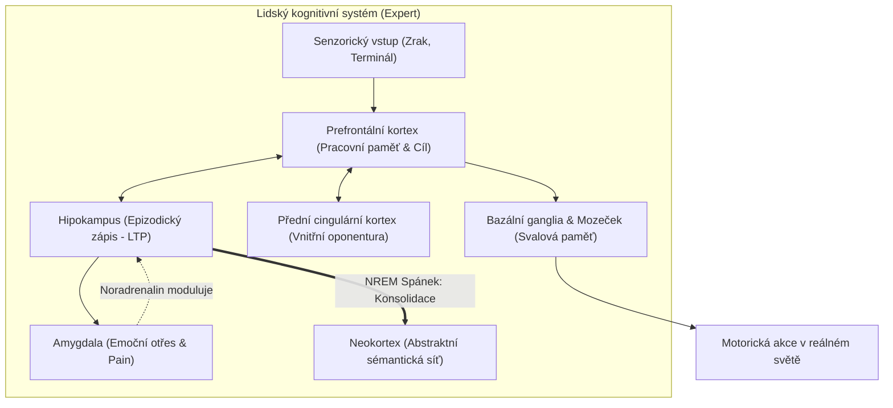

# Proposal 07: Neurokognitivní architektura lidského mozku vs. LLM modely a AI agenti (Neurocognitive Subsystems, Parametric Limitations & The UMA Coprocessor Mapping)

**Status:** Draft / Architectural Foundation & Comparative Analysis  
**Cílová vrstva:** `uma-core/`, `uma-cli/`, `uma-pi-extension/`, architektura celého systému UMA  
**Vazby na předchozí návrhy:**  
- **Poskytuje sjednocující teoretický a biologický rámec pro všechny předchozí návrhy (Proposals 01–06):**
  - [Proposal 01 (Kognitivní imunita)](file:///D:/01_programovani/ai-memory/docs/proposals/01-cognitive-immune-interceptor.md) $\leftrightarrow$ Hematoencefalická bariéra a somatické markery.
  - [Proposal 02 (Stínový mozek / Zero-Latency)](file:///D:/01_programovani/ai-memory/docs/proposals/02-shadow-brain-zero-latency-distillation.md) $\leftrightarrow$ Spánková konsolidace a hipokampální replay (NREM spánek).
  - [Proposal 03 (Synaptická plasticita & Kontrakty)](file:///D:/01_programovani/ai-memory/docs/proposals/03-synaptic-plasticity-executable-contracts.md) $\leftrightarrow$ Dlouhodobá potenciace (LTP), Hebbovo učení a Ebbinghausovo zapomínání.
  - [Proposal 04 (Vnitřní sněm a opatrnost)](file:///D:/01_programovani/ai-memory/docs/proposals/04-internal-council-and-prudence.md) $\leftrightarrow$ Přední cingulární kortex (ACC), detekce kognitivního konfliktu a Amygdala (Pain Score).
  - [Proposal 05 (Procedurální svalová paměť)](file:///D:/01_programovani/ai-memory/docs/proposals/05-procedural-muscle-memory-and-cognitive-priming.md) $\leftrightarrow$ Bazální ganglia, Mozeček a teorie kompilace produkčních pravidel (ACT-R).
  - [Proposal 06 (Git-to-Memory Bridge)](file:///D:/01_programovani/ai-memory/docs/proposals/06-git-commit-memory-bridge-and-markdown-lifecycle.md) $\leftrightarrow$ Senzorická epizodická paměť a deterministická krystalizace do OKF v0.2.  
**Datum:** 2026-10-08  

---

## 1. Úvod a filosoficko-technické východisko

Současný vývoj v oblasti umělé inteligence trpí fundamentálním neporozuměním lidské kognici. Dominantní paradigma staví na předpokladu:
> *„Větší model s větším množstvím parametrů a obřím kontextovým oknem (1M–10M tokenů) vyřeší všechny kognitivní limity agentů.“*

Tento předpoklad je z hlediska neurobiologie, matematické optimalizace i praktického softwarového inženýrství mylný.

Lidský mozek experta (např. seniorního systémového inženýra nebo analytika) **nepracuje tak, že by v každém okamžiku držel v pracovní paměti miliony slov kontextu**. Lidský mozek funguje na principu **vysoce specializovaných, evolučně oddělených subsystémů**, které spolupracují v reálném čase:
- **Neokortex** (abstraktní uvažování a řeč) je podporován **Hipokampem** (rychlý epizodický zápis),
- **Bazálními ganglii a Mozečkem** (okamžité motorické reflexy bez účasti vědomí),
- **Amygdalou** (emoční fixace kritických chyb a pud sebezáchovy),
- a **Předním cingulárním kortexem** (neustálá vnitřní oponentura a inhibice impulzivního jednání).

LLM (Large Language Model) je naproti tomu **pouze izolovaný syntetický neokortex** – gigantická asociační síť se zmrazenými vahami, která postrádá veškeré ostatní kognitivní orgány.

Tento dokument provádí hloubkovou komparaci biologických mechanismů lidské paměti, tréninku frontier LLM modelů a limitů dnešních AI agentů, a formalizuje UMA jako **kompletní neurokognitivní koprocesor**.

---

## 2. Velká srovnávací matice: Člověk vs. LLM vs. Agent vs. UMA

| Kognitivní subsystém & Biologické centrum | Neurobiologický mechanismus v lidském mozku | Jak je trénován a jak funguje čistý LLM | Jak funguje běžný frontier agent (Claude Code, Cursor) | Jak to řeší architektura UMA (Proposals 01–06) |
| :--- | :--- | :--- | :--- | :--- |
| **Pracovní paměť & Udržování cíle**<br>*(Dorzolaterální prefrontální kortex - dlPFC)* | Rychlý kapacitně omezený buffer (4–7 položek). Aktivní udržování primárního cíle navzdory vyrušení. Nulová energetická režie. | **Kontextové okno (KV Cache):**<br>Pozornostní matice (Self-Attention). Lineární/kvadratická výpočetní náročnost. | Celá historie chatu v jednom okně. Se zvětšujícím se kontextem nastává pozornostní degradace (*Lost in the Middle*). | **L1 Session Priming & Goal Ledger:**<br>Dynamický, ultrakompaktní blok (max 50 tokenů), který chrání KV prefix cache. |
| **Epizodická paměť & Jednorázový zápis**<br>*(Hipokampus & Gyrus Dentatus)* | **One-Shot Learning:**<br>Okamžitý zápis události v čase a prostoru pomocí Dlouhodobé potenciace (LTP). Rychlá synaptická plasticita. | **Nulová za běhu:**<br>Při inferenci jsou váhy striktně zmrazené ($\nabla W = 0$). Model nemá žádnou možnost zapsat si novou trvalou zkušenost. | Spoléhá na surový chat nebo `git log -3`. Po 3 commitech nebo po restartu session nastává **úplná amnézie**. | **Git-to-Memory Bridge ([Proposal 06](file:///D:/01_programovani/ai-memory/docs/proposals/06-git-commit-memory-bridge-and-markdown-lifecycle.md)):**<br>Deterministické uložení poučení z commitů do trvalých `.uma/facts/*.md`. |
| **Emoční valence & Bolest ze selhání**<br>*(Amygdala)* | **Flashbulb Memory:**<br>Krizové selhání uvolní noradrenalin. Způsobí doživotní reflex *„tuto akci za těchto podmínek nikdy neopakuj“*. | **Globální zprůměrovaná ztráta:**<br>RLHF/DPO penalizoval chování během tréninku, ale model necítí žádnou bolest ze zničení tvé produkční DB. | Žádná amygdala. Agent klidně zopakuje stejný smazaný soubor nebo pád DB třikrát za sebou v jedné session. | **Pain Score & Imunita ([Proposal 01](file:///D:/01_programovani/ai-memory/docs/proposals/01-cognitive-immune-interceptor.md), [04](file:///D:/01_programovani/ai-memory/docs/proposals/04-internal-council-and-prudence.md)):**<br>Hardwarově rychlý interceptor blokující akce s vysokým rizikovým skóre. |
| **Sémantická konsolidace & Spánek**<br>*(Neokortex & Spánková vřetena)* | **Teorie CLS (McClelland):**<br>Během NREM spánku přehrává hipokampus epizody do neokortexu. Z tisíců detailů se vydestilují obecná pravidla. | **Pretraining:**<br>Statická ztrátová komprese internetu do parametrů modelu. Trvá měsíce a stojí miliony dolarů. Nelze lokálně aktualizovat. | Žádná konsolidace. Uživatel musí pravidla udržovat ručně psaním statických instrukcí v `CLAUDE.md`. | **Shadow Brain Distillation ([Proposal 02](file:///D:/01_programovani/ai-memory/docs/proposals/02-shadow-brain-zero-latency-distillation.md)):**<br>Asynchronní worker na pozadí slučuje fakta, detekuje duplicity a navrhuje supersedence. |
| **Procedurální svalová paměť**<br>*(Bazální ganglia & Mozeček)* | **Production Compilation (ACT-R):**<br>Často opakované vědomé kroky se zkompilují do motorických bloků bez účasti vnitřní řeči a uvažování. | **Nulová:**<br>Model neumí provést akci bez generování slov. Každý krok musí projít přes nejpomalejší vrstvu – generování textových tokenů. | **Plýtvání System 2:**<br>Agent pálí 15 sekund a 1000 reasoning tokenů na rutinní kontrolu `git status` a spuštění testů. | **Compiled Action Chunks ([Proposal 05](file:///D:/01_programovani/ai-memory/docs/proposals/05-procedural-muscle-memory-and-cognitive-priming.md)):**<br>Nativní rutiny v Rustu (`uma_muscle`), které probíhají v OS za 5 ms bez volání LLM. |
| **Inhibice impulzů & Vnitřní hlas**<br>*(Přední cingulární kortex - ACC)* | **Anděl vs. Ďábel:**<br>Paralelní debata mezi touhou po rychlé odměně a obezřetností. Detekce kognitivního konfliktu (ERN vlna). | **Autoregresní predikce:**<br>Model je náchylný generovat nejpravděpodobnější pokračování bez schopnosti včas se zarazit a zpochybnit premisu. | **Sycophancy (Nekritičnost):**<br>Agent slepě provede nebezpečný požadavek uživatele nebo svůj chybný první nápad bez oponentury. | **Vnitřní sněm ([Proposal 04](file:///D:/01_programovani/ai-memory/docs/proposals/04-internal-council-and-prudence.md)):**<br>Syntetický spor Anděla a Ďáblova advokáta před exekucí jakékoliv riskantní operace. |
| **Asociační aktivace & Priming**<br>*(Temporální lalok)* | **Spreading Activation:**<br>Při zmínce o tématu se v podvědomí automaticky aktivují související pojmy dříve, než jsou vědomě vyvolány. | **Softmax přes slovník:**<br>Pouze lokální distribuce tokenů. Žádné trvalé asociační grafy mezi externími koncepty projektu. | Naivní fulltextový RAG vyhledávač, který vrátí 20 nesouvisejících úryvků kódu plných balastu. | **Asociační priming sítě ([Proposal 05](file:///D:/01_programovani/ai-memory/docs/proposals/05-procedural-muscle-memory-and-cognitive-priming.md)):**<br>Vážené propojení souborů, chyb a pravidel s bleskovou hybridní aktivací (BM25 + Vektory). |

---

## 3. Detailní analýza neurobiologických subsystémů



### 3.1 Hipokampus vs. Parametrická slepota LLM (Teorie CLS)
V neurobiologii formulovali McClelland, McNaughton a O'Reilly teorii **Complementary Learning Systems (CLS)**:
- Žádný inteligentní systém nemůže mít pouze jednu paměťovou síť. Kdyby se lidský neokortex učil z každé události okamžitě změnou svých hlubokých synapsí, utrpěl by **katastrofické zapomínání (catastrophic interference)** – nová vzpomínka na dnešní oběd by přemazala schopnost mluvit mateřským jazykem.
- Proto příroda vyvinula **Hipokampus**: vysoce plastický dočasný buffer, který funguje jako rychlý adresář.
- **LLM modely mají pouze neokortex.** Jejich trénink probíhá měsíce předem. V okamžiku, kdy agent sedí nad tvým repozitářem, **nemá žádný hipokampus**.
- **Role UMA:** UMA představuje externí, transparentní hipokampální systém. Soubory `.uma/facts/*.md` formátu OKF v0.2 ukládají epizodické události ihned (např. poučení z commitu), aniž by bylo nutné přetrénovávat biliony parametrů modelu.

### 3.2 Amygdala, Somatické markery a Pain Score
Neurovědec Antonio Damasio popsal teorii **Somatických markerů**:
- Člověk se nerozhoduje čistě racionální logikou. Pokud v minulosti udělal závažnou chybu, která vedla k průšvihu, tělo si vytvoří fyziologický marker (sevření žaludku, zrychlený tep).
- Když se člověk v budoucnu ocitne v analogické situaci, tento somatický marker **předem zablokuje riskantní volbu**, ještě než o ní začne vědomě uvažovat.
- **Dnešní AI agenti nemají žádný somatický marker.** Protože necítí bolest ani riziko, opakují stejné chyby, smazání souborů či ignorování testů.
- **Role UMA:** [Proposal 01](file:///D:/01_programovani/ai-memory/docs/proposals/01-cognitive-immune-interceptor.md) a [Proposal 04](file:///D:/01_programovani/ai-memory/docs/proposals/04-internal-council-and-prudence.md) zavádějí **Pain Score**:
  $$\text{RiskScore}(a) = \text{BlastRadius}(a) \times (1.0 - \text{Confidence}(a)) \times \text{PainWeight}$$
  Pokud je toto skóre překročeno, UMA imunitní interceptor fyzicky zablokuje spuštění příkazu a vynutí ověření.

### 3.3 Bazální ganglia a Teorie kompilace produkcí (ACT-R)
John R. Anderson ve své kognitivní architektuře **ACT-R (Adaptive Control of Thought-Rational)** popsal proces osvojování dovedností:
1. **Kognitivní fáze (System 2):** Začátečník musí o každém kroku přemýšlet a verbalizovat ho v duchu (deklarativní instrukce).
2. **Asociativní fáze:** Dochází k detekci chyb a zrychlování.
3. **Autonomní fáze (System 1 - Procedurální kompilace):** Vědomá mysl se zcela odpoutá. Posloupnost operací se sloučí do jediného produkčního pravidla spouštěného bazálními ganglii a řízeného mozečkem.
- **Problém současných agentů:** Všichni frontier agenti (Claude, GPT, Gemini) uvízli **navždy v kognitivní fázi 1**. Na každou triviální rutinu generují desítky vět vnitřního monologu, které posílají do API a platí za ně čas i peníze.
- **Role UMA:** [Proposal 05](file:///D:/01_programovani/ai-memory/docs/proposals/05-procedural-muscle-memory-and-cognitive-priming.md) přináší **kompilované motorické rutiny (`uma_muscle`)** implementované v nativním Rustu.

---

## 4. Architektonické mapování UMA jako Kognitivního koprocesoru

Tento diagram znázorňuje, jak jednotlivé vrstvy a proposals systému UMA tvoří ucelený kognitivní stroj doplňující LLM jádro:

```mermaid
flowchart LR
    subgraph SensoryInput ["Senzorika (Prostředí)"]
        GitCommit["Git Commits / Diffs"]
        TerminalOut["Výstupy kompilátoru a testů"]
        UserPrompt["Zadání uživatele"]
    end

    subgraph UMA_Coprocessor ["UMA Kognitivní Koprocesor (Rust Runtime)"]
        direction TB
        subgraph Sub_Immune ["1. Amygdala & Imunita (Proposal 01 & 04)"]
            PainScore["Pain Score Engine"]
            ImmuneGate["Secrets & Safety Interceptor"]
        end

        subgraph Sub_Hippo ["2. Hipokampus & Epizody (Proposal 06)"]
            GitBridge["Git-to-Memory Bridge"]
            OKF_Store[".uma/facts/*.md (OKF v0.2)"]
        end

        subgraph Sub_Plasticity ["3. Synaptická plasticita (Proposal 03)"]
            SynapticWeights["Synaptic Weight Matrix"]
            DecayEngine["Ebbinghaus Decay Engine"]
        end

        subgraph Sub_Shadow ["4. Spánková konsolidace (Proposal 02)"]
            ShadowWorker["Asynchronní Stínový Pracovník"]
            Consolidator["Deduplikace & Supersedence"]
        end

        subgraph Sub_Muscle ["5. Mozeček & Svalová paměť (Proposal 05)"]
            CompiledChunks["Rust Compiled Action Chunks"]
            PrimingEngine["Associative Priming Index"]
        end
    end

    subgraph LLM_Core ["LLM Reasoning Engine (Neokortex)"]
        System2["System 2 uvažování (Claude / GPT / Gemini)"]
        WorkingContext["KV Cache / Kontextové okno"]
    end

    %% Propojení toků
    SensoryInput ==> ImmuneGate
    ImmuneGate --> GitBridge
    GitBridge --> OKF_Store
    OKF_Store <--> SynapticWeights
    OKF_Store <--> DecayEngine
    OKF_Store ==> ShadowWorker
    ShadowWorker --> Consolidator

    OKF_Store --> PrimingEngine
    PrimingEngine -->|L1 Priming (max 50 tokenů)| WorkingContext

    WorkingContext <--> System2
    System2 -->|Vysloví motorický záměr| CompiledChunks
    CompiledChunks -->|Spustí rutinu v OS| TerminalOut

    System2 -->|Návrh riskantní akce| PainScore
    PainScore -->|Veta / Schválení| System2
```

---

## 5. Proč pouhé zvětšování kontextového okna (2M–10M tokenů) selhává

Průmyslový narativ tvrdí, že s příchodem milionových kontextových oken je externí paměť zbytečná. Neurokognitivní srovnání odhaluje 3 zásadní limity tohoto přístupu:

### 1. Pozornostní ředění (Attention Entropy & Needle in Haystack)
- V lidském mozku je velikost pracovní paměti striktně omezena právě proto, aby se zabránilo informačnímu kolapsu.
- U LLM transformátorů roste s délkou kontextu pravděpodobnost, že mechanismus Self-Attention přiřadí váhu irelevantnímu šumu. Vzniká fenomén **kognitivní netečnosti**: model sice „vidí“ informaci na řádku 150 000, ale nedokáže ji rigorózně aplikovat, protože je přehlušena okolním kontextem.

### 2. Finanční a latanční past (KV Cache Economics)
- Udržování a přepočítávání obřích kontextových oken přináší enormní latenci. Time-To-First-Token (TTFT) dramaticky narůstá.
- Změna jediného řádku v dlouhé historii zneplatní prefixovou cache a vyžaduje kompletní přepočet KV matice.
- **UMA naproti tomu udržuje L1 kontext na pouhých 30–50 tokenech**, což zaručuje okamžitou odezvu a 100% využití prefix cache.

### 3. Absence řízeného zapomínání a supersedence
- V nekonečném kontextovém okně se hromadí protichůdná rozhodnutí z minulých týdnů. Model pak halucinuje mezi dvěma starými verzemi kódu.
- Biologický mozek přežívá díky **aktivnímu zapomínání (LTD - Long-Term Depression)** a přepisování starých schémat.
- UMA toto realizuje matematicky pomocí `validity: superseded` a exponenciálního rozpadu synaptických vah ([Proposal 03](file:///D:/01_programovani/ai-memory/docs/proposals/03-synaptic-plasticity-executable-contracts.md)).

---

## 6. Závěr: Nová definice kognitivní architektury

Tato komparace dokazuje, že budoucnost autonomního softwarového inženýrství nespočívá v pasivním čekání na větší základní modely, ale v **doplnění chybějících kognitivních orgánů**:

1. **LLM je jazykový a logický procesor (Neokortex).**
2. **Git a lokální OS jsou fyzická realita.**
3. **UMA (Proposals 01–06) je kompletní neurobiologický obal:**
   - Zajišťuje trvalou paměť bez amnézie,
   - bleskové svalové reflexy bez plýtvání tokeny,
   - imunitní ochranu před destruktivními omyly,
   - a vnitřní opatrnost zkušeného systémového myslitele.

Tento proposal slouží jako sjednocující fundament pro veškerý další vývoj a implementaci subsystémů UMA.
